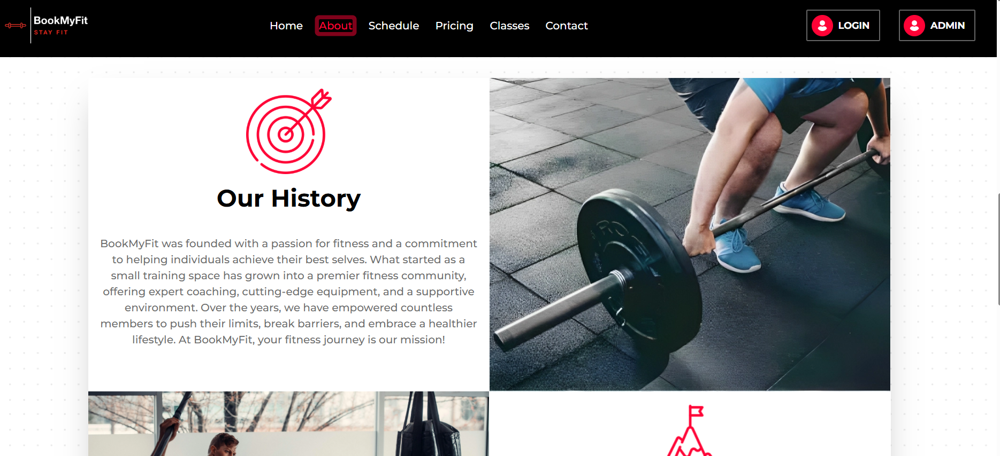
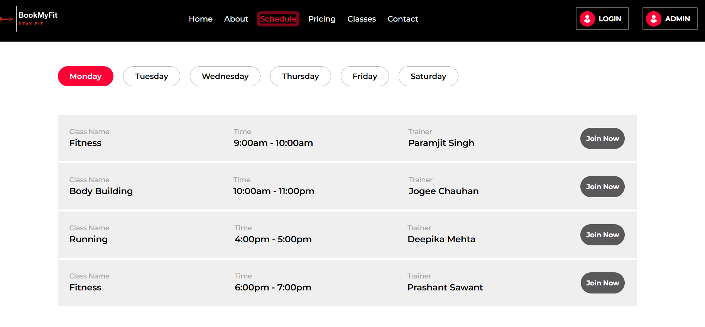
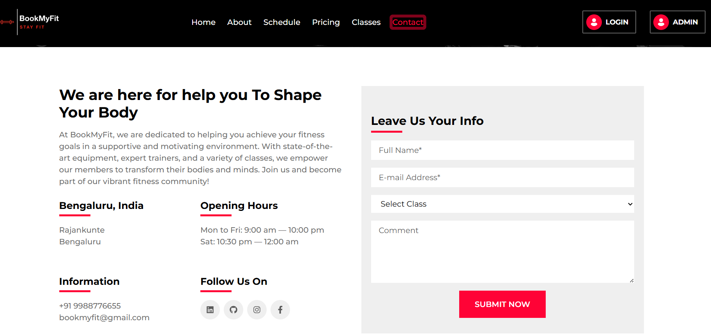

# BookMyFit
A modern and responsive fitness management app built with React.js and Tailwind CSS. It allows users to track workouts, manage gym memberships, schedule training sessions, and monitor fitness progress—all with a sleek, user-friendly interface optimized for performance and usability.

Your go-to platform for fitness class bookings.  
👉 **Live Site:** [https://bookmyfit-1.onrender.com/](https://bookmyfit-1.onrender.com/)

Vite 
React 
JavaScript 
TailwindCSS 

## Screenshot

